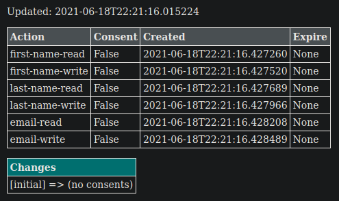

# EvalBlockchain

Explore extensions and applicability of Blockchain to guarantee integrity and traceability of private data. 

Confluence Page: [MODL - EvalBlockchain](https://www.crim.ca/confluence/display/PATR/MODL+-+EvalBlockchain)
> Évaluer l’utilisation du blockchain pour garantir l’intégrité et la traçabilité des données privées.


[][version-url]

[version-url]: https://www.crim.ca/stash/projects/PATR/repos/MODL-EvalBlockChain?at=refs/tags/0.11.2

## Installation

1. Make sure [Python 3.6+](https://www.python.org/downloads/) is installed. 
2. Install the dependencies in your preferred virtual environment manager (`pipenv`, `conda`, etc.) 

```shell
pip install -e <blockchain-repo-root> 
```

3. Generate one or more blockchains:
```shell
python blockchain/app.py --port 5002 --db file://<custom-directory> --new
 ```

4. Run one or more server nodes:
```shell
python blockchain/app.py  # defaults to port 5000, and file storage in "./db" location 
python blockchain/app.py -p 5001 --db file://<custom-directory>  # loads all "<blockchain-id>/chain.json" in directory
python blockchain/app.py -p 5002 --db file://<custom-directory>/<id>/chain.json  # loads only that blockchain
python blockchain/app.py -p 5003 --db file://<custom-directory>/chains.txt  # loads only listed blockchains IDs
python blockchain/app.py --port 5004 --db <db-impl>://<db-connector>  # use an alternate database implementation
```

When running server nodes, any predefined set of nodes within a shared network should be provided directly 
with the ``--nodes='<node1-url>,<node2-url>,...'`` option to allow consensus resolution between nodes.
Otherwise, nodes can be registered after startup using the relevant API endpoints.

Alternatively to above calling method of the web application that starts a single listener (useful for debugging), 
running using ``gunicorn`` is better for servers to employ multi-worker nodes that allow answering to more requests 
in parallel:

```shell
gunicorn \
  "blockchain.app:run(host='<public-ip>', port=5001, db='file://<custom-directory>', nodes='0.0.0.0:5002,0.0.0.0:5003')" \
  --bind 0.0.0.0:5001 \
  --workers 4
```

The parameters normally provided as CLI options when calling ``python`` must be passed directly to the ``run`` function 
when using ``gunicorn`` WSGI runner since it does not allow additional parameters as input 
(options are specific to ``gunicorn``). The ``--bind`` parameter should use ``0.0.0.0`` to ensure proper reception of
requests from any endpoints, regardless of the exposed IP by the server. This will allow connecting to the web 
application both locally (``localhost``) and remotely (exposed URL of the server hosting this service node).   

5. Once started, refer to the following endpoints for OpenAPI requests and details:

Details about the current blockchain node:
```http request
GET localhost:<port>/
```

OpenAPI description: 
```http request
GET localhost:<port>/api
```

6. Refer to usage help for further customization options: 
```shell
python blockchain/app.py --help
```
    
## Docker

Another option for running this blockchain program is to use Docker.  
Follow the instructions below to create a local Docker container:

1. Clone this repository
2. Build the docker container

```shell
docker build -t blockchain .
```

3. Run the container

```shell
docker run --rm -p 80:5000 blockchain
```

4. To add more instances, vary the public port number before the colon:

```shell
docker run --rm -p 81:5000 blockchain
docker run --rm -p 82:5000 blockchain
docker run --rm -p 83:5000 blockchain
```

## Contributing

Contributions are welcome! Please feel free to submit a Pull Request.

## Resources

Following are the reference resources and source code employed to start development of this project.

- [Original code: dvf/blockchain](https://github.com/dvf/blockchain)
- [Building a Blockchain blogpost](https://medium.com/p/117428612f46)


## Blockchain Contents

The blockchains are intended to contain tracking of *Consent* changes and resolution. 
Each blockchain UUID (multiple chains per nodes) represent a potential *user* for management their *Consents*.

Following is a visual representation of such *Consents* using UI endpoints.




Similar details can be retrieved from the API endpoints, as well as further operations on the blockchains and nodes
their should process consensus resolution against.

The *Consents* are generated with a set of demonstration *Actions*, which can be extended as needed by modifying the
`ConsentsAction` enumeration.
